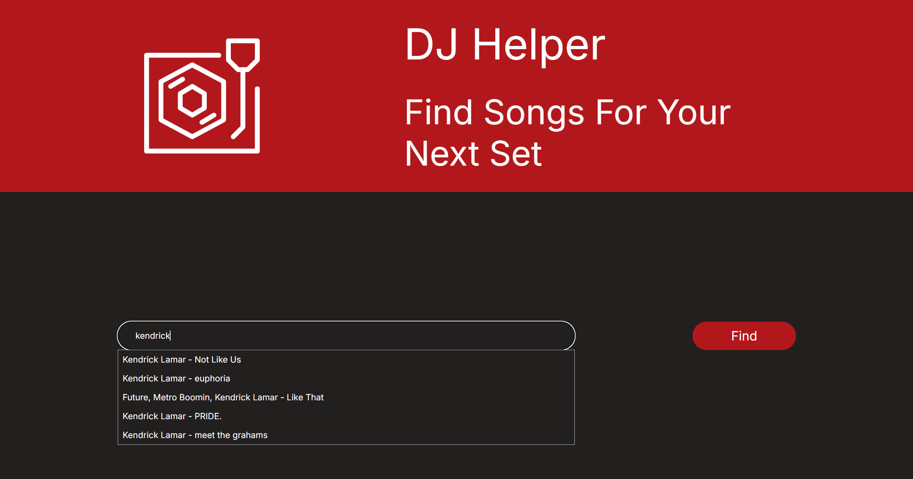
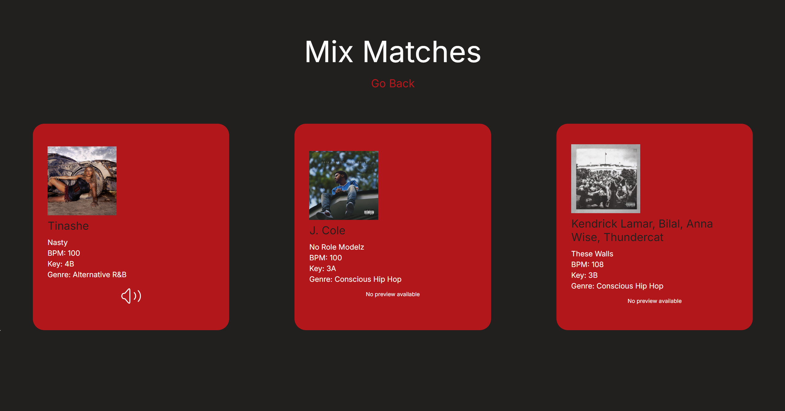

# DJ Helper

A Django-based web application designed to help DJs find songs that mix well together. This tool allows users to search for a specific song and receive recommendations for other tracks that match in BPM, key, and genre.




## Features

- **Song Recommendations:** Get song suggestions that match in BPM, key, and genre for smooth transitions.
- **Search Functionality:** Search for any song and get mixing recommendations.
- **Autocomplete Dropdown:** As you type in the search bar, a dropdown suggests matching songs to help you quickly find the track you're looking for.
- **Audio Previews:** Listen to a preview of the recommended tracks directly within the app.
- **Responsive Design:** The application is fully responsive, providing an optimal viewing experience across all devices.

## APIs Used

This project uses the following API to fetch data:

- **[Spotify API](https://developer.spotify.com/):** Provides data on song attributes like BPM, key, genre, and cover art.

Make sure to obtain API keys and set them up in your environment variables as part of the installation or deployment process.

## Installation

### Prerequisites

Ensure you have Python 3.x installed on your system. You can download it from [python.org](https://www.python.org/).

### Required Python Packages

This project requires the following Python packages:
- `Django`
- `requests`

You can install them using `pip`:

```bash
pip install django requests
```

### Setting Up the Project

1. Clone this repository to your local machine:

   ```bash
   git clone https://github.com/ry-schwartz/dj_helper.git
   cd dj_helper
   ```
2. Ensure all dependencies are installed (as mentioned above).

3. Run database migrations:

    ```bash
   python manage.py migrate
   ```

4. Collect static files:

    ```bash
   python manage.py collectstatic
   ```

5. Set up environment variables for the API key(s):

    ```bash
   export SPOTIFY_API_KEY='your-spotify-api-key'
   ```

### Usage

To run the application locally, navigate to the project directory and execute the following command:

   ```bash
   python manage.py runserver
   ```

1. Open your web browser and go to `http://127.0.0.1:8000/`.
2. Use the search bar on the home page to find a song.
3. As you type, a dropdown will suggest matching songs.
4. View the song recommendations and listen to previews.

### Deployment on Heroku

This project is configured to be deployed on Heroku. Follow these steps:

1. Ensure you have the Heroku CLI installed.

2. Log in to your Heroku account:

    ```bash
   heroku login
   ```

3. Create a new Heroku application:

    ```bash
   heroku create dj_helper
   ```

4. Set up the environment variables required for the project:

    ```bash
   heroku config:set SECRET_KEY='your-secret-key'
   heroku config:set DEBUG=0
   heroku config:set SPOTIFY_API_KEY='your-spotify-api-key'
   ```

5. Push the code to Heroku:

    ```bash
   git push heroku main
   ```

6. Run the database migrations on Heroku:

    ```bash
   heroku run python manage.py migrate
   ```

7. Open the application in your web browser:

    ```bash
   heroku open
   ```

### Troubleshooting

- If the application fails to fetch data, ensure you have an active internet connection.
- If no data is displayed for a song, verify that the song exists and that its API data is available.
- On Heroku, make sure that all environment variables are correctly set.

### Contributing

Contributions are welcome! Please fork the repository and submit a pull request if you wish to improve the application or fix bugs.